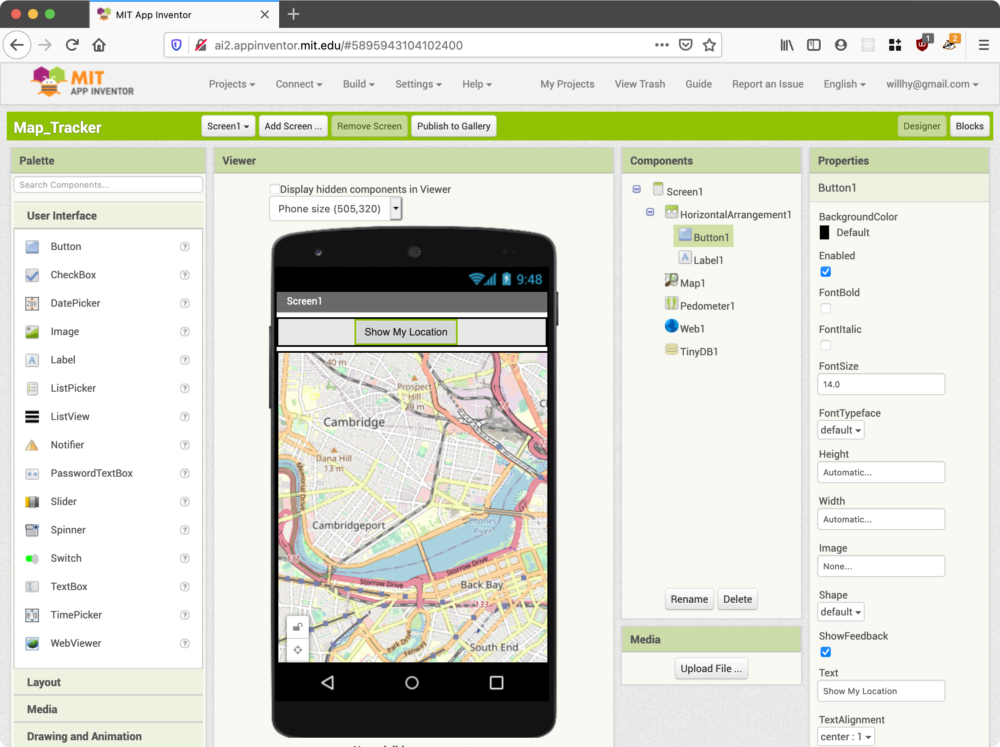
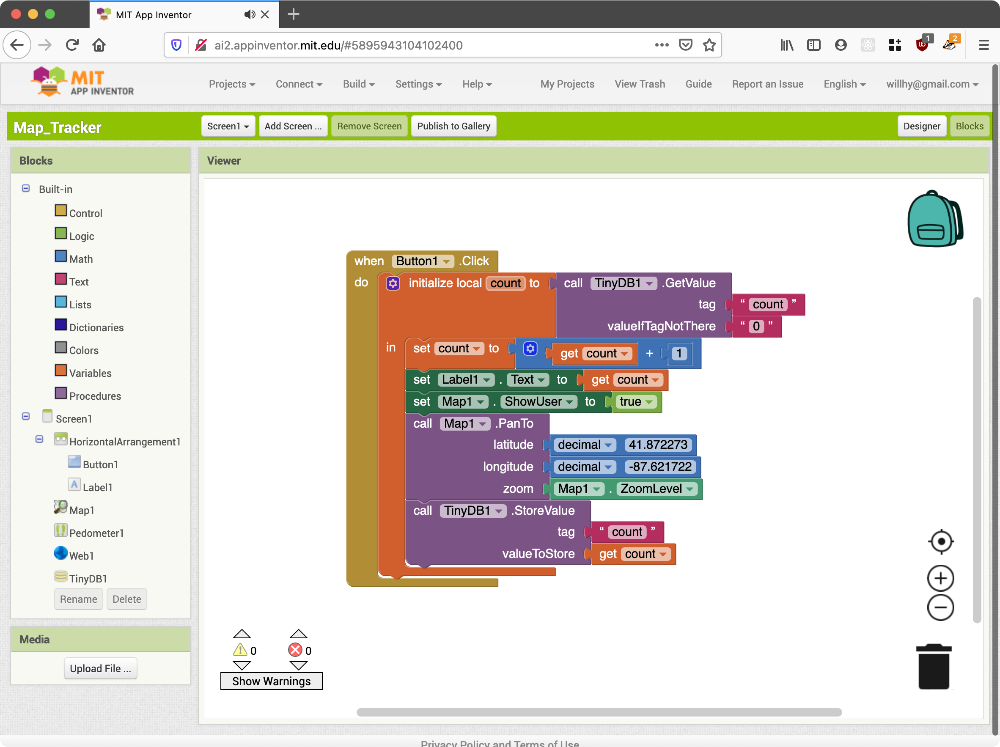

The [MIT App Inventor](http://ai2.appinventor.mit.edu) seems a bit outdated, but it also has some fairly powerful abilities.

# Pros

* Simple to create a UI
* Simple to generate a real Android app
* Don't need to learn native app development
* Supports multiple screens, maps, persistence (database), basic logic, pedometer

# Cons / Unknowns

* Collaboration. How do multiple people work on a single project?
* Can it do everything we need?

# Suggestion

This is _at least_ a good prototyping tool. It's a nice way to do a basic mock-up/barebones design for an app.

# Features

Drag and drop view/UI components can be moved around to design the interface for the Android App

A scratch-like editor allows dragging code blocks around to create application logic.

The app can save data to a database and can run on an Android Emulator. An `.apk` file can also be downloaded to run the app on a real Android device.

