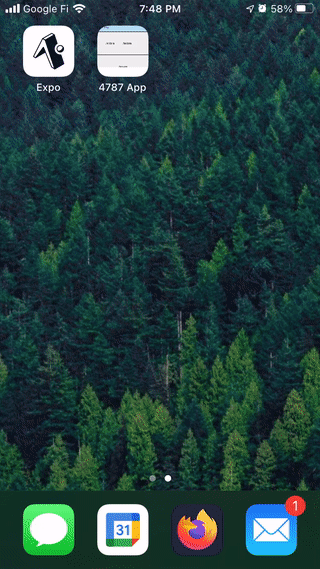

A [progressive web app](https://web.dev/what-are-pwas/#the-best-of-both-worlds) is a modern way of using a website to power an installable app that runs on smart phones.

Check out [an example site here](https://frc.willhy.com/). Load it on a phone and [add the app to your home screen](https://natomasunified.org/kb/add-website-to-mobile-device-home-screen/) to install it. This is not just a bookmark, but a progressive web app.

This is _not_ simply a website. This is a web application. It can be installed on a phone like a real app, it can use a database, it can use maps, it can even work offline like an app might.

# Pros

* Learn web development (powerful skill)
* Simpler to collaborate and share code
* Can work on Android, iOS, or the web
* Don't need to learn native app development
* Freedom to build almost anything we want

# Cons / Unknowns

* Would need a crash course in web development. A more universal skill than app development, but still a bit of a learning curve
* Is this too complex for us to easily build what we need?

# Suggestion

I think this may be a good compromise between building a native app and MIT App Inventor. We're able to use a very modern popular technology for building a web application, and web skills are more easy to use on other projects than app skills.

# Features

Installable on an iPhone or Android device like a real app

